# 目录

* [使用循环神经网络破解验证码](#使用循环神经网络破解验证码)
* [四则混合运算识别（初赛）](#四则混合运算识别（初赛）)
* [四则混合运算识别（决赛）](#四则混合运算识别（决赛）)

# 使用循环神经网络破解验证码

对于这种按顺序书写的文字，我们可以使用循环神经网络来识别序列。下面我们来了解一下如何使用循环神经网络来识别这类验证码。

captcha 部分的代码和之前卷积神经网络识别的一样，只是将 `n_class` 改为了 `len(characters)+1`，因为我们需要添加一个空白类用于 CTC Loss。

参考链接：[使用深度学习来破解 captcha 验证码](https://zhuanlan.zhihu.com/p/26078299)

```py
from captcha.image import ImageCaptcha
import matplotlib.pyplot as plt
import numpy as np
import random

%matplotlib inline
%config InlineBackend.figure_format = 'retina'

import string
characters = string.digits + string.ascii_uppercase
print(characters)

width, height, n_len, n_class = 170, 80, 4, len(characters)+1

generator = ImageCaptcha(width=width, height=height)
random_str = ''.join([random.choice(characters) for j in range(4)])
img = generator.generate_image(random_str)

plt.imshow(img)
plt.title(random_str)
```

## CTC Loss

这个 loss 是一个特别神奇的 loss，它可以在只知道序列的顺序，不知道具体位置的情况下，让模型收敛。（[warp-ctc](https://github.com/baidu-research/warp-ctc)）


那么在 Keras 里面，CTC Loss 已经内置了，我们直接定义这样一个函数即可，由于我们使用的是循环神经网络，所以默认丢掉前面两个输出，因为它们通常无意义，且会影响模型的输出。

* y\_pred 是模型的输出，是按顺序输出的37个字符的概率，因为我们这里用到了循环神经网络，所以需要一个空白字符的类；
* labels 是验证码，是四个数字，每个数字对应字符的编号；
* input\_length 表示 y\_pred 的长度，我们这里是15；
* label\_length 表示 labels 的长度，我们这里是4。

```py
from keras import backend as K

def ctc_lambda_func(args):
    y_pred, labels, input_length, label_length = args
    y_pred = y_pred[:, 2:, :]
    return K.ctc_batch_cost(labels, y_pred, input_length, label_length)
```

## 模型结构

我们的模型结构是这样设计的，首先通过卷积神经网络去识别特征，然后经过一个全连接降维，再按水平顺序输入到一种特殊的循环神经网络，叫 GRU，全程是 Gated Recurrent Unit，可以理解为是 LSTM 的简化版。LSTM 早在1997年就已经被发明出来了，但是 GRU 直到2014年才出现。经过实验，GRU 效果比 LSTM 要好。

参考链接：https://zhuanlan.zhihu.com/p/28297161

```py
from keras.models import *
from keras.layers import *
from keras.optimizers import *
rnn_size = 128

input_tensor = Input((width, height, 3))
x = input_tensor
x = Lambda(lambda x:(x-127.5)/127.5)(x)
for i in range(3):
    for j in range(2):
        x = Convolution2D(32*2**i, 3, kernel_initializer='he_uniform')(x)
        x = BatchNormalization()(x)
        x = Activation('relu')(x)
    x = MaxPooling2D((2, 2))(x)

conv_shape = x.get_shape().as_list()
rnn_length = conv_shape[1]
rnn_dimen = conv_shape[2]*conv_shape[3]
print(conv_shape, rnn_length, rnn_dimen)
x = Reshape(target_shape=(rnn_length, rnn_dimen))(x)
rnn_length -= 2

x = Dense(rnn_size, kernel_initializer='he_uniform')(x)
x = BatchNormalization()(x)
x = Activation('relu')(x)
x = Dropout(0.2)(x)

gru_1 = GRU(rnn_size, return_sequences=True, kernel_initializer='he_uniform', name='gru1')(x)
gru_1b = GRU(rnn_size, return_sequences=True, kernel_initializer='he_uniform', 
             go_backwards=True, name='gru1_b')(x)
x = add([gru_1, gru_1b])

gru_2 = GRU(rnn_size, return_sequences=True, kernel_initializer='he_uniform', name='gru2')(x)
gru_2b = GRU(rnn_size, return_sequences=True, kernel_initializer='he_uniform', 
             go_backwards=True, name='gru2_b')(x)
x = concatenate([gru_2, gru_2b])

x = Dropout(0.2)(x)
x = Dense(n_class, activation='softmax')(x)
base_model = Model(inputs=input_tensor, outputs=x)

labels = Input(name='the_labels', shape=[n_len], dtype='float32')
input_length = Input(name='input_length', shape=[1], dtype='int64')
label_length = Input(name='label_length', shape=[1], dtype='int64')
loss_out = Lambda(ctc_lambda_func, output_shape=(1,), 
                  name='ctc')([x, labels, input_length, label_length])

model = Model(inputs=[input_tensor, labels, input_length, label_length], outputs=[loss_out])
model.compile(loss={'ctc': lambda y_true, y_pred: y_pred}, optimizer='adam')
```

从 Input 到 最后一个 MaxPooling2D，是一个很深的卷积神经网络，它负责学习字符的各个特征，尽可能区分不同的字符。它输出 shape 是 `[None, 17, 6, 128]`，这个形状相当于把一张宽为 170，高为 80 的彩色图像 (170, 80, 3)，压缩为宽为 17，高为 6 的 128维特征的特征图 (17, 6, 128)。

然后我们把图像 reshape 成 (17, 768)，也就是把高和特征放在一个维度，然后降维成 (17, 128)，也就是从左到右有17条特征，每个特征128个维度。

这128个维度就是这一条图像的非常高维，非常抽象的概括，然后我们将17个特征向量依次输入到 GRU 中，GRU 有能力学会不同特征向量的组合会代表什么字符，即使是字符之间有粘连也不会怕。这里使用了双向 GRU，

最后 Dropout 接一个全连接层，作为分类器输出每个字符的概率。

这个是 base\_model 的结构，也是我们模型的结构。那么后面的 labels, input\_length, label\_length 和 loss_out 都是为了输入必要的数据来计算 CTC Loss 的。


## 模型可视化

可视化的代码同上，这里只贴图。


可以看到模型比上一个模型复杂了许多，但实际上只是因为输入比较多，所以它显得很大。还有一个值得注意的地方，我们的图片在输入的时候是经过了旋转的，这是因为我们希望以水平方向输入循环神经网络，而图片在 numpy 里默认是这样的形状：(height, width, 3)，因此我们使用了 `transpose` 函数将图片转为了(width, height, 3)的格式，这样就能把 X 轴转到第一个维度，方便输入到循环神经网络。

## 数据生成器

根据模型的输入，我们需要输入四个数据：

* X 是一批图片；
* y 是每个图片对应的 label，最大长度为 n_len；
* input\_length 表示模型输出的长度，我们这里是15；
* label\_length 表示 labels 的长度，我们这里是4。

最后还有一个输入是 `np.ones(batch_size)`，这是因为 Keras 在训练模型的时候必须输入一个 X 和一个 y，我们这里把上面四个都合并为一个 X 了，因此实际上 y 没有参与 loss 的计算，所以随便编一个 `batch_size` 长度的数据输入进去就好了。

```py
def gen(batch_size=128):
    X = np.zeros((batch_size, width, height, 3), dtype=np.uint8)
    y = np.zeros((batch_size, n_len), dtype=np.uint8)
    generator = ImageCaptcha(width=width, height=height)
    while True:
        for i in range(batch_size):
            random_str = ''.join([random.choice(characters) for j in range(n_len)])
            X[i] = np.array(generator.generate_image(random_str)).transpose(1, 0, 2)
            y[i] = [characters.find(x) for x in random_str]
        yield [X, y, np.ones(batch_size)*rnn_length, np.ones(batch_size)*n_len], np.ones(batch_size)
```

我们可以举个例子，使用一次生成器，看看输出的是什么内容：

```py
(X_vis, y_vis, input_length_vis, label_length_vis), _ = next(gen(1))
print(X_vis.shape, y_vis, input_length_vis, label_length_vis)

plt.imshow(X_vis[0].transpose(1, 0, 2))
plt.title(''.join([characters[i] for i in y_vis[0]]))
```

我们可以看到输出了下面的内容：

`(1, 170, 80, 3) [[29  4 21 21]] [ 15.] [ 4.]`


这里：

* X 的 shape 是 `(1, 170, 80, 3)`，如果有 n 张图，shape 就是 `(n, 170, 80, 3)`
* y 是 label，我们可以看到生成的图片是 T4LL，那么按上面的 characters，label 就是 `[29 4 21 21]`，外面还有一个框是因为这里面可以有 n 个 label
* input\_length 表示模型输出的长度，我们这里是15；
* label\_length 表示 labels 的长度，我们这里是4。

## 评估模型

我们会通过这个函数来评估我们的模型，和上面的评估标准一样，只有全部正确，我们才算预测正确。这里有个坑，就是模型最开始训练的时候，并不一定会输出四个字符，所以我们如果遇到所有的字符都不到四个的时候，就不用计算了，一定是全错。遇到多于四个字符的时候，只取前四个。

```py
def evaluate(batch_size=128, steps=10):
    batch_acc = 0
    generator = gen(batch_size)
    for i in range(steps):
        [X_test, y_test, _, _], _  = next(generator)
        y_pred = base_model.predict(X_test)
        shape = y_pred[:,2:,:].shape
        ctc_decode = K.ctc_decode(y_pred[:,2:,:], input_length=np.ones(shape[0])*shape[1])[0][0]
        out = K.get_value(ctc_decode)[:, :n_len]
        if out.shape[1] == n_len:
            batch_acc += (y_test == out).all(axis=1).mean()
    return batch_acc / steps
```

## 评估回调

因为 Keras 没有针对 CTC 模型计算准确率的选项，因此我们需要自定义一个回调函数，它会在每一代训练完成的时候计算模型的准确率。

```py
from keras.callbacks import *

class Evaluator(Callback):
    def __init__(self):
        self.accs = []
    
    def on_epoch_end(self, epoch, logs=None):
        acc = evaluate(steps=20)*100
        self.accs.append(acc)
        print('')
        print('acc: %f%%' % acc)

evaluator = Evaluator()
```

## 训练模型

我们先按 `Adam(1e-3)` 的学习率训练20代，让模型快速收敛，然后以 `Adam(1e-4)` 的学习率再训练20代。这里设置每代训练 400 个 step，也就是每代 `400*128=51200` 个样本，验证集设置的是 `20*128=2048` 个样本。

```py
h = model.fit_generator(gen(128), steps_per_epoch=400, epochs=20,
                        callbacks=[evaluator],
                        validation_data=gen(128), validation_steps=20)
```

```py
model.compile(loss={'ctc': lambda y_true, y_pred: y_pred}, optimizer=Adam(1e-4))
h2 = model.fit_generator(gen(128), steps_per_epoch=400, epochs=20, 
                        callbacks=[evaluator],
                        validation_data=gen(128), validation_steps=20)
```

然后我们将 loss 和 acc 的曲线图画出来：

```py
plt.figure(figsize=(10, 4))
plt.subplot(1, 2, 1)
plt.plot(h.history['loss'] + h2.history['loss'])
plt.plot(h.history['val_loss'] + h2.history['val_loss'])
plt.legend(['loss', 'val_loss'])
plt.ylabel('loss')
plt.xlabel('epoch')
plt.ylim(0, 1)

plt.subplot(1, 2, 2)
plt.plot(evaluator.accs)
plt.ylabel('acc')
plt.xlabel('epoch')
```


训练到20代的时候，模型是这样的表现：

```
Epoch 20/20
399/400 [============================>.] - ETA: 0s - loss: 0.1593
acc: 97.929688%
400/400 [==============================] - 122s - loss: 0.1589 - val_loss: 0.1671
```

训练到40代的时候，模型是这样的表现：

```
Epoch 20/20
399/400 [============================>.] - ETA: 0s - loss: 0.1317
acc: 99.570312%
400/400 [==============================] - 123s - loss: 0.1315 - val_loss: 0.1130
```

## 测试模型

```py
(X_vis, y_vis, input_length_vis, label_length_vis), _ = next(gen(12))

y_pred = base_model.predict(X_vis)
shape = y_pred[:,2:,:].shape
ctc_decode = K.ctc_decode(y_pred[:,2:,:], input_length=np.ones(shape[0])*shape[1])[0][0]
out = K.get_value(ctc_decode)[:, :4]

plt.figure(figsize=(16, 8))
for i in range(12):
    plt.subplot(3, 4, i+1)
    plt.imshow(X_vis[i].transpose(1, 0, 2))
    plt.title('pred:%s\nreal :%s' % (''.join([characters[x] for x in out[i]]), 
                                     ''.join([characters[x] for x in y_vis[i]])))
```

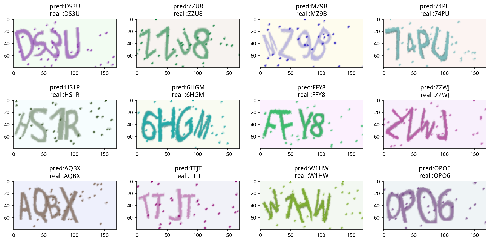

## 评估模型

我们可以尝试计算模型的总体准确率，以及看看模型到底错在哪。首先生成1024个样本，然后用 `base_model` 进行预测，然后裁剪并进行 ctc 解码，最后裁剪到4个 label 并与真实值进行对比。

```py
(X_vis, y_vis, input_length_vis, label_length_vis), _ = next(gen(10000))

y_pred = base_model.predict(X_vis, verbose=1)
shape = y_pred[:,2:,:].shape
ctc_decode = K.ctc_decode(y_pred[:,2:,:], input_length=np.ones(shape[0])*shape[1])[0][0]
out = K.get_value(ctc_decode)[:, :4]

(y_vis == out).all(axis=1).mean()

# 0.99460000000000004
```

输出结果是99.46%的准确率，已经比上一个模型强很多了。

我们可以对预测错的样本进行统计：

```py
from collections import Counter
Counter(''.join([characters[i] for i in y_vis[y_vis != out]]))

Counter({'0': 37, 'O': 14, 'Q': 1, 'T': 1, 'W': 1})
```

我们可以发现模型在 0 和 O 的准确率稍微低一点，其他的错误都只是个例。0与 O 确实是很难分辨的，我们可以尝试用代码生成一个 '0O0O' 的图像，然后用模型预测：

```py
characters2 = characters + ' '

generator = ImageCaptcha(width=width, height=height)
random_str = '0O0O'
X_test = np.array(generator.generate_image(random_str))
X_test = X_test.transpose(1, 0, 2)
X_test = np.expand_dims(X_test, 0)

y_pred = base_model.predict(X_test)
shape = y_pred[:,2:,:].shape
ctc_decode = K.ctc_decode(y_pred[:,2:,:], input_length=np.ones(shape[0])*shape[1])[0][0]
out = K.get_value(ctc_decode)[:, :4]
out = ''.join([characters[x] for x in out[0]])

plt.imshow(X_test[0].transpose(1, 0, 2))
plt.title('pred:' + str(out))

argmax = np.argmax(y_pred, axis=2)[0]
list(zip(argmax, ''.join([characters2[x] for x in argmax])))
```


可以看到模型预测得还是很准的。

## 总结

模型的大小是3.3MB，在显卡上跑10000张验证码需要用9秒，平均一秒识别一千张以上，完全可以拼过网速。即使是在笔记本上跑，也可以跑到一秒几十张的速度，因此此类验证码可以说已经被破解了。

# 四则混合运算识别（初赛）
 
本节会详细介绍我在进行四则混合运算识别竞赛初赛时的所有思路。

核心思想在前面，所以此处会省略部分重复内容。

## 问题描述

本次竞赛目的是为了解决一个 OCR 问题，通俗地讲就是实现图像到文字的转换过程。

### 数据集

初赛数据集一共包含10万张180*60的图片和一个labels.txt的文本文件。每张图片包含一个数学运算式，运算式包含：

3个运算数：3个0到9的整型数字；
2个运算符：可以是+、-、*，分别代表加法、减法、乘法
0或1对括号：括号可能是0对或者1对

图片的名称从0.png到99999.png，下面是一些样例图片（这里只取了一张）：


文本文件 labels.txt 包含10w行文本，每行文本包含每张图片对应的公式以及公式的计算结果，公式和计算结果之间空格分开，例如图片中的示例图片对应的文本如下所示：

```
(3-7)+5 1
5-6+2 1
(6+7)*2 26
(4+2)+7 13
(6*4)*4 96
```

### 评价指标

官方的评价指标是准确率，初赛只有整数的加减乘运算，所得的结果一定是整数，所以要求序列与运算结果都正确才会判定为正确。

我们本地除了会使用官方的准确率作为评估标准以外，还会使用 CTC loss 来评估模型。

## 使用 captcha 进行数据增强

官方提供了10万张图片，我们可以直接使用官方数据进行训练，也可以通过Captcha，参照官方训练集，随机生成更多数据，进而提高准确性。根据题目要求，label 必定是三个数字，两个运算符，一对或没有括号，根据括号规则，只有可能是没括号，左括号和右括号，因此很容易就可以写出数据生成器的代码。

### 生成器

生成器的生成规则很简单：

```py
import string
import random

digits = string.digits
operators = '+-*'
characters = digits + operators + '() '

def generate():
    seq = ''
    k = random.randint(0, 2)
    
    if k == 1:
        seq += '('
    seq += random.choice(digits)
    seq += random.choice(operators)
    if k == 2:
        seq += '('
    seq += random.choice(digits)
    if k == 1:
        seq += ')'
    seq += random.choice(operators)
    seq += random.choice(digits)
    if k == 2:
        seq += ')'
    
    return seq
```

相信大家都能看懂。当然，我写文章的时候又想到一种更好的写法：

```py
import random

def generate():
	ts = [u'{}{}{}{}{}', '({}{}{}){}{}', '{}{}({}{}{})']
	ds = u'0123456789'
	os = u'+-*'
	cs = [random.choice(ds) if x%2 == 0 else random.choice(os) for x in range(5)]
	return random.choice(ts).format(*cs)
```

除了生成算式以外，还有一个值得注意的地方就是初赛所有的减号（也就是“-”）都是细的，但是我们直接用 captcha 库生成图像会得到粗的减号，所以我们修改了 [image.py](https://github.com/lepture/captcha/blob/v0.2.2/captcha/image.py) 中的代码，在 `_draw_character` 函数中我们增加了一句判断，如果是减号，我们就不进行 resize 操作，这样就能防止减号变粗：

```py
# line 191-194
if c != '-':
    im = im.resize((w2, h2))
    im = im.transform((w, h), Image.QUAD, data)
```

我们继而使用生成器生成四则运算验证码：

```py
import string
import os

digits = string.digits
operators = '+-*'
characters = digits + operators + '() '
width, height, n_len, n_class = 180, 60, 7, len(characters) + 1
from captcha.image import ImageCaptcha
generator = ImageCaptcha(width=width, height=height,
	font_sizes=range(35, 56), 
    fonts=['fonts/%s'%x for x in os.listdir('fonts') if '.tt' in x]
)
generator.generate_image('(1-2)-3')
```


上图就是原版生成器生成的图，我们可以看到减号是很粗的。


上图是修改过的生成器，可以看到减号已经不粗了。

## 模型结构

```py
from keras.layers import *
from keras.models import *
from make_parallel import make_parallel
rnn_size = 128

input_tensor = Input((width, height, 3))
x = input_tensor
for i in range(3):
    x = Conv2D(32*2**i, (3, 3), kernel_initializer='he_normal')(x)
    x = BatchNormalization()(x)
    x = Activation('relu')(x)
    x = Conv2D(32*2**i, (3, 3), kernel_initializer='he_normal')(x)
    x = BatchNormalization()(x)
    x = Activation('relu')(x)
    x = MaxPooling2D(pool_size=(2, 2))(x)

conv_shape = x.get_shape()
x = Reshape(target_shape=(int(conv_shape[1]), int(conv_shape[2]*conv_shape[3])))(x)

x = Dense(128, kernel_initializer='he_normal')(x)
x = BatchNormalization()(x)
x = Activation('relu')(x)

gru_1 = GRU(rnn_size, return_sequences=True, kernel_initializer='he_normal', name='gru1')(x)
gru_1b = GRU(rnn_size, return_sequences=True, go_backwards=True, kernel_initializer='he_normal', 
             name='gru1_b')(x)
gru1_merged = add([gru_1, gru_1b])

gru_2 = GRU(rnn_size, return_sequences=True, kernel_initializer='he_normal', name='gru2')(gru1_merged)
gru_2b = GRU(rnn_size, return_sequences=True, go_backwards=True, kernel_initializer='he_normal', 
             name='gru2_b')(gru1_merged)
x = concatenate([gru_2, gru_2b])
x = Dropout(0.25)(x)
x = Dense(n_class, kernel_initializer='he_normal', activation='softmax')(x)
base_model = Model(input=input_tensor, output=x)

base_model2 = make_parallel(base_model, 4)

labels = Input(name='the_labels', shape=[n_len], dtype='float32')
input_length = Input(name='input_length', shape=(1,), dtype='int64')
label_length = Input(name='label_length', shape=(1,), dtype='int64')
loss_out = Lambda(ctc_lambda_func, name='ctc')([base_model2.output, labels, input_length, label_length])

model = Model(inputs=(input_tensor, labels, input_length, label_length), outputs=loss_out)
model.compile(loss={'ctc': lambda y_true, y_pred: y_pred}, optimizer='adam')
```

模型结构像之前写的文章一样，只是把卷积核的个数改多了一点，加了一些 BN 层，并且在四卡上做了一点小改动以支持多GPU训练。如果你是单卡，可以直接去掉 `base_model2 = make_parallel(base_model, 4)` 的代码。

BN 层主要是为了训练加速，实验结果非常好，模型收敛快了很多。

base_model 的可视化：


model 的可视化：


## 模型训练

在经过几次测试以后，我已经抛弃了 evaluate 函数，因为在验证集上已经能做到 100% 识别率了，所以只需要看 val_loss 就可以了。在经过之前的几次尝试以后，我发现在有生成器的情况下，训练代数越多越好，因此直接用 adam 跑了50代，每代10万样本，可以看到模型在10代以后基本已经收敛。


我们可以看到模型先分为四份，在四个显卡上并行计算，然后合并结果，计算最后的 ctc loss，进而训练模型。

## 结果可视化

这里我们对生成的数据进行了可视化，可以看到模型基本已经做到万无一失，百发百中。

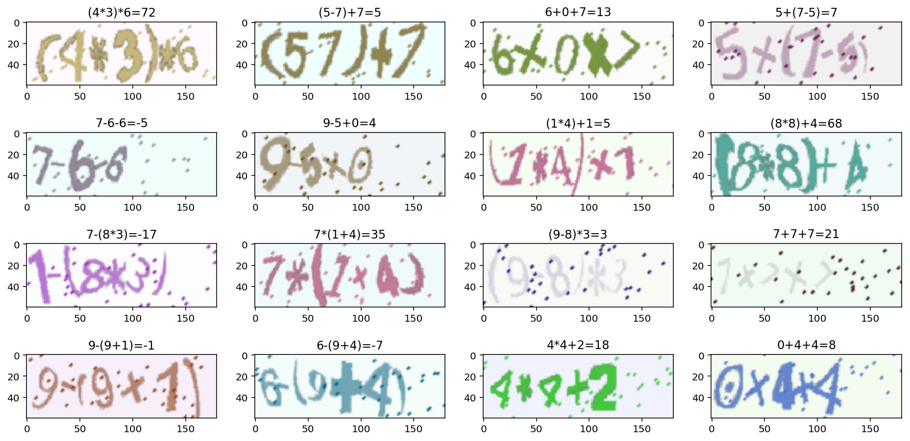


打包成 docker 以后提交到比赛系统中，经过十几分钟的运行，我们得到了完美的1分。

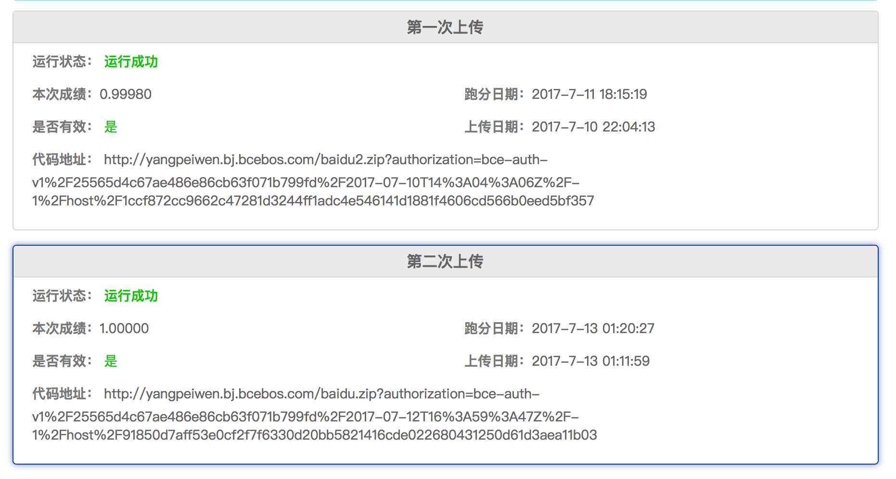

## 总结

初赛是非常简单的，因此我们才能得到这么准的分数，之后官方进一步提升了难度，将初赛测试集提高到了20万张，在这个集上我们的模型只能拿到0.999925的成绩，可行的改进方法是将准确率进一步降低，充分训练模型，将多个模型结果融合等。

### 官方扩充测试集的难点

在扩充数据集上，我们发现有一些图片预测出来无法计算，比如 `[629,2271,6579,17416,71857,77631,95303,102187,117422,142660,183693]` 等，这里我们取 117422.png 为例。


我们可以看到肉眼基本无法认出这个图，但是经过一定的图像处理，我们可以显现出来它的真实面貌：

```py
IMAGE_DIR = 'image_contest_level_1_validate'
index = 117422

img = cv2.imread('%s/%d.png' % (IMAGE_DIR, index))
gray = cv2.cvtColor(img, cv2.COLOR_BGR2GRAY)
h = cv2.equalizeHist(gray)
```

然后我们可以看到这样的结果：

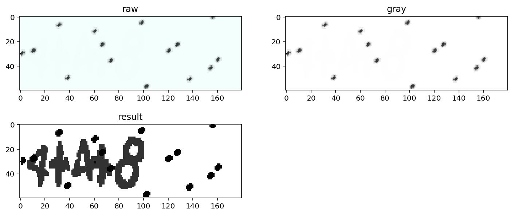

当然，还有一张图是无法通过预处理得到结果的，142660，这有可能是程序的 bug 造成的小概率事件，所以初赛除了我们跑了一个 docker 得到满分以外，没有第二个人达到满分。


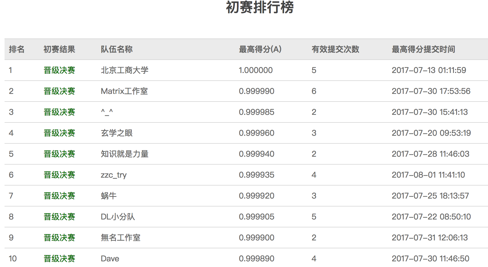

# 四则混合运算识别（决赛）
 
本节会详细介绍我在进行四则混合运算识别竞赛决赛时的所有思路。

## 问题描述

本次竞赛目的是为了解决一个 OCR 问题，通俗地讲就是实现图像到文字的转换过程。

### 数据集

决赛数据集一共包含10万张图片和一个labels.txt的文本文件。每张图片包含一个数学运算式，运算式中包含：

1. 图片大小不固定
2. 图片中的某一块区域为公式部分
3. 图片中包含二行或者三行的公式
4. 公式类型有两种：赋值和四则运算的公式。两行的包括由一个赋值公式和一个计算公式，三行的包括两个赋值公式和一个计算公式。加号（+） 即使旋转为 x ，仍为加号， * 是乘号
5. 赋值类的公式，变量名为一个汉字。 汉字来自两句诗（不包括逗号）： 君不见，黄河之水天上来，奔流到海不复回 烟锁池塘柳，深圳铁板烧
6. 四则运算的公式包括加法、减法、乘法、分数、括号。 其中的数字为多位数字，汉字为变量，由上面的语句赋值。
7. 输出结果的格式为：图片中的公式，一个英文空格，计算结果。 其中： 不同行公式之间使用英文分号分隔 计算结果时，分数按照浮点数计算，计算结果误差不超过0.01，视为正确。
8. 整个label文件使用UTF8编码

决赛样例：

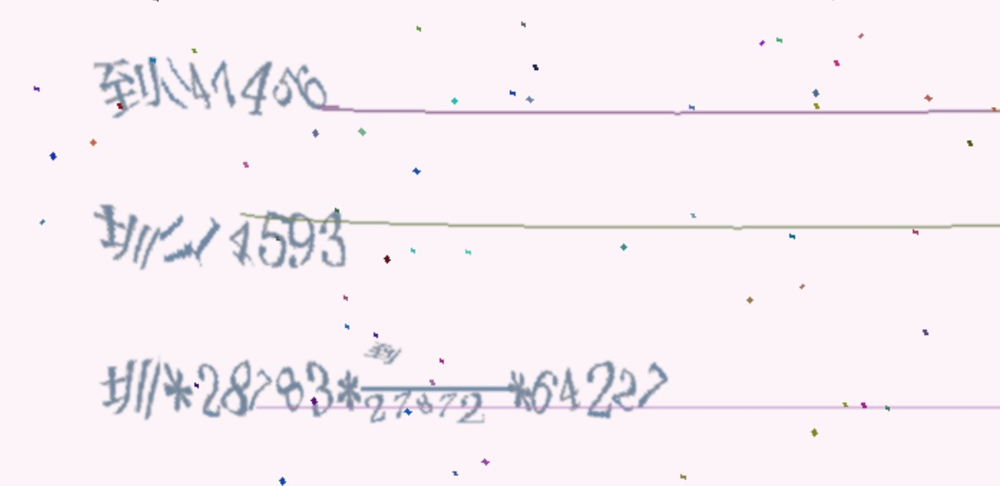

初赛的题不难，只需要识别文本序列即可，决赛的算式比较复杂，需要先经过图像处理，然后才能输入到神经网络中进行端到端的文本序列识别。

### 评价指标

官方的评价指标是准确率，初赛只有整数的加减乘运算，所得的结果一定是整数，所以要求序列与运算结果都正确才会判定为正确。

但决赛的数字通常都是五位数，并且会有很多乘法和加法，以及一定会存在的一个分数，所以结果很容易超出64位浮点数所能表示的范围，因此官方在经过讨论后决定只考虑文本序列的识别，不评价运算结果。

而我们本地除了会使用官方的准确率作为评估标准以外，还会使用 CTC loss 来评估模型。

## 数据的探索

### 定义

决赛的数据集探索就复杂得多，我们先明确两个概念：

`流=42072;圳=86;(圳-(97510*45921))*流/35864`

在这个式子中，`流=42072;圳=86;`被称为赋值式，`(圳-(97510*45921))*流/35864`被称为表达式，赋值式和表达式统称为公式，`+-*/`被称为运算符。

### 分析

首先我们对样本的每个字出现的次数进行了统计：

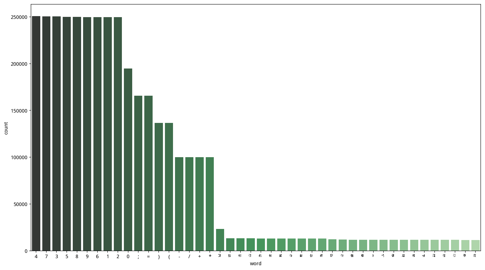

可以看到数字的分布很有意思，0出现的次数比其他数字都低，其他的数字出现次数基本一样，所以立即推这是直接按随机数生成的，0不能出现在首位，所以概率变低。

分号和等号出现的次数一样，这是因为每个赋值式都有一个等号和一个分号。它出现的概率是 1.65807，因此可以猜出一个赋值式和两个赋值式的比例是 1:2。

运算符出现的概率都是一样的，所以可以推断它们是直接随机取的。

括号出现的概率是 1.36505，我们统计了一下括号出现的所有可能：

```
1+1+1+1

(1+1)+1+1
1+(1+1)+1
1+1+(1+1)
(1+1+1)+1
1+(1+1+1)

((1+1)+1)+1
(1+(1+1))+1

1+((1+1)+1)
1+(1+(1+1))

(1+1)+(1+1)
```

一共有11种可能，按括号的数量统计括号出现的频率可以得出 2*5/11.0+5/11.0 = 1.3636，因此括号也是从上面几种模板随机取的。

中文除了“不”字出现了两次，概率翻倍，其他字概率基本相等。中文字取自于下面两句诗：“君不见，黄河之水天上来，奔流到海不复回 烟锁池塘柳，深圳铁板烧”，所以也可以推断出是按字直接随机取的。

### 总结

* 中文直接等概率取，“不”概率加倍
* 括号从11种情况中随机取
* 运算符每次必出四个
* 1/3概率取一个赋值式，2/3概率取2个赋值式
* 运算符/永远都会出现一次，中文在上
* 运算符+-*随机取，概率都是1/3
* 数字取值范围是[0, 100000]

## 数据预处理

由于原始的图像十分巨大，直接输入到 CNN 中会有90%以上的区域是没有用的，所以我们需要对图像做预处理，裁剪出有用的部分。然后因为图像有两到三个式子，因此我们采取的方案是从左至右拼接在一起，这样的好处是图像比较小。（900\*80=72000 vs 600\*270=162000）

我主要使用了以下几种技术：

* [转灰度图](http://docs.opencv.org/master/df/d9d/tutorial_py_colorspaces.html)
* [直方图均衡](http://docs.opencv.org/master/d5/daf/tutorial_py_histogram_equalization.html)
* [中值滤波](http://docs.opencv.org/master/d4/d13/tutorial_py_filtering.html)
* [开闭运算](http://docs.opencv.org/master/d9/d61/tutorial_py_morphological_ops.html)
* [二值化](http://docs.opencv.org/master/d7/d4d/tutorial_py_thresholding.html)
* [轮廓查找](http://docs.opencv.org/master/d4/d73/tutorial_py_contours_begin.html)
* [边界矩形](http://docs.opencv.org/master/dd/d49/tutorial_py_contour_features.html)

首先先进行初步的关键区域提取：

```py
def plot(index):
    img = cv2.imread('%s/%d.png'%(IMAGE_DIR, index))
    gray = cv2.cvtColor(img, cv2.COLOR_BGR2GRAY)

    eq = cv2.equalizeHist(gray)
    b = cv2.medianBlur(eq, 9)
    
    m, n = img.shape[:2]
    b2 = cv2.resize(b, (n//4, m//4))

    m1 = cv2.morphologyEx(b2, cv2.MORPH_OPEN, np.ones((7, 40)))
    m2 = cv2.morphologyEx(m1, cv2.MORPH_CLOSE, np.ones((4, 4)))
    _, bw = cv2.threshold(m2, 127, 255, cv2.THRESH_BINARY_INV)
    
    bw = cv2.resize(bw, (n, m))

    r = img.copy()
    img2, ctrs, hier = cv2.findContours(bw, cv2.RETR_EXTERNAL, 
      cv2.CHAIN_APPROX_SIMPLE)
    for ctr in ctrs:
        x, y, w, h = cv2.boundingRect(ctr)
        cv2.rectangle(r, (x, y), (x+w, y+h), (0, 255, 0), 10)
```

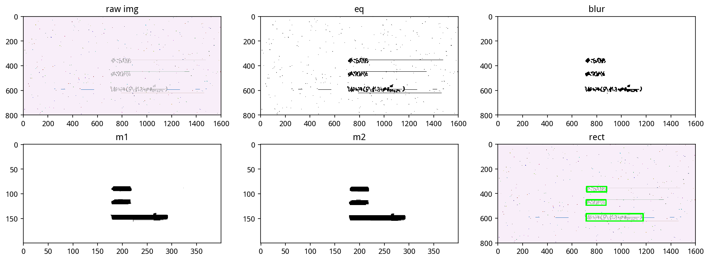

### 去噪

首先要将图像[转灰度图](http://docs.opencv.org/master/df/d9d/tutorial_py_colorspaces.html)，然后用初赛使用的[直方图均衡](http://docs.opencv.org/master/d5/daf/tutorial_py_histogram_equalization.html)提高图像的对比度，这里噪点还在，所以需要进行滤波，我们这里使用了[中值滤波](http://docs.opencv.org/master/d4/d13/tutorial_py_filtering.html)，它能很好地滤掉噪点和干扰线。（上图的 blur）

### 连接公式

现在我们只关心公式的提取，而不在意字符的提取（因为无法保证准确提取），所以我们需要将这些字符连接起来。这里首先对图像进行了4倍的缩放，然后使用了一种叫做[开闭运算](http://docs.opencv.org/master/d9/d61/tutorial_py_morphological_ops.html)的算法来连接字符。因为我们要的是横向连接，纵向不需要连接，所以我们选择了 (7, 40) 大小的开运算，然后为了滤掉不必要的噪声，我们使用了 (4, 4) 的闭运算。（位于上图中间的 m2）

### 关键区域提取

在拼接好公式以后，我们就可以对图像使用[轮廓查找](http://docs.opencv.org/master/d4/d73/tutorial_py_contours_begin.html)的算法了，很容易我们就可以抓到图像的三个边缘点集，然后我们使用[边界矩形](http://docs.opencv.org/master/dd/d49/tutorial_py_contour_features.html)函数得到矩形的 (x, y, w, h)，完成关键区域提取。提取之后我们将绿色的矩形画在了原图上。（位于上图右下角的 rect）

### 微调

由于之前使用了很大的 kernel 进行滤波，所以这里需要进行一个微调的操作：

```py
# 微调三个公式
d = 20
d2 = 5
imgs = []
sizes = []
for i, ctr in enumerate(ctrs):
    x, y, w, h = cv2.boundingRect(ctr)
    roi = img[max(0, y-d):min(m, y+h+d),max(0, x-d):min(n, x+w+d)]
    p, q, _ = roi.shape
    
    x = b[max(0, y-d):min(m, y+h+d),max(0, x-d):min(n, x+w+d)]
    x = cv2.morphologyEx(x, cv2.MORPH_CLOSE, np.ones((3, 3)))
    _, x = cv2.threshold(x, 127, 255, cv2.THRESH_BINARY_INV)
    _, x, _ = cv2.findContours(x, cv2.RETR_EXTERNAL, cv2.CHAIN_APPROX_SIMPLE)
    x, y, w, h = cv2.boundingRect(np.vstack(x))
    roi2 = roi[max(0, y-d2):min(p, y+h+d2),max(0, x-d2):min(q, x+w+d2)]
    imgs.append(roi2)
    sizes.append(roi2.shape)
```

首先通过之前的矩形，扩充20像素，然后裁剪出关键区域，这里是直接对滤波的图裁剪，所以分辨率很高。然后经过简单的闭运算滤波，二值化，提取边框，这里即使有噪点也不用担心，裁多了不要紧，裁少了才麻烦，然后裁出来的图可能会比较小，因为滤波过了，所以再扩充5个像素，达到不错的效果。

以下是几个例子：

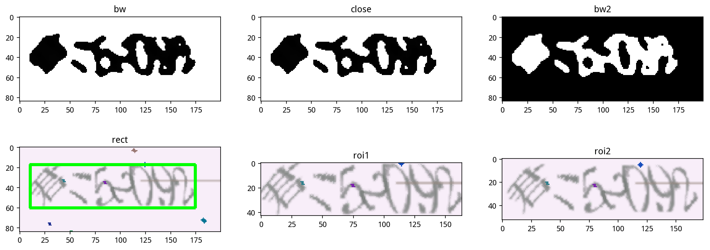

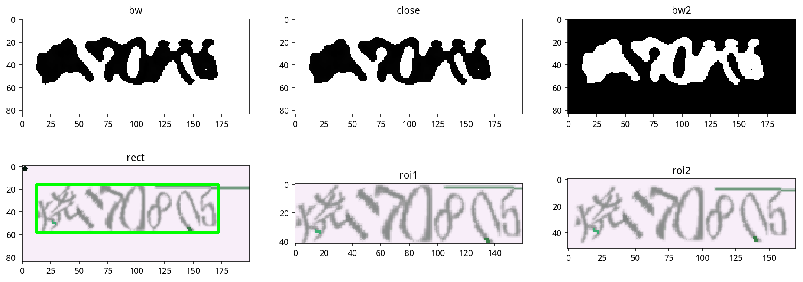


### 连接三个公式

裁出来准确的公式以后，我们就可以直接进行横向连接了：

```py
# 连接三个公式
sizes = np.array(sizes)
img2 = np.zeros((sizes[:,0].max(), sizes[:,1].sum()+2*(len(sizes)-1), 3),
                dtype=np.uint8)
x = 0
for a in imgs[::-1]:
    w = a.shape[1]
    img2[:a.shape[0], x:x+w] = a
    x += w + 2
```

下图是拼接好的图像：


### 并行预处理

如果直接使用 python 的 for 循环去跑，只能占用一个核的 CPU 利用率，为了充分利用 CPU，我们使用了多进行并行预处理的方法让每个 CPU 都能满载运行。为了能够实时查看进度，我使用了 tqdm 这个进度条的库。

```py
p = Pool(12)

n = 100000
if __name__ == '__main__':
    rs = []
    for r in tqdm(p.imap_unordered(f, range(n)), total=n):
        rs.append(r)
```

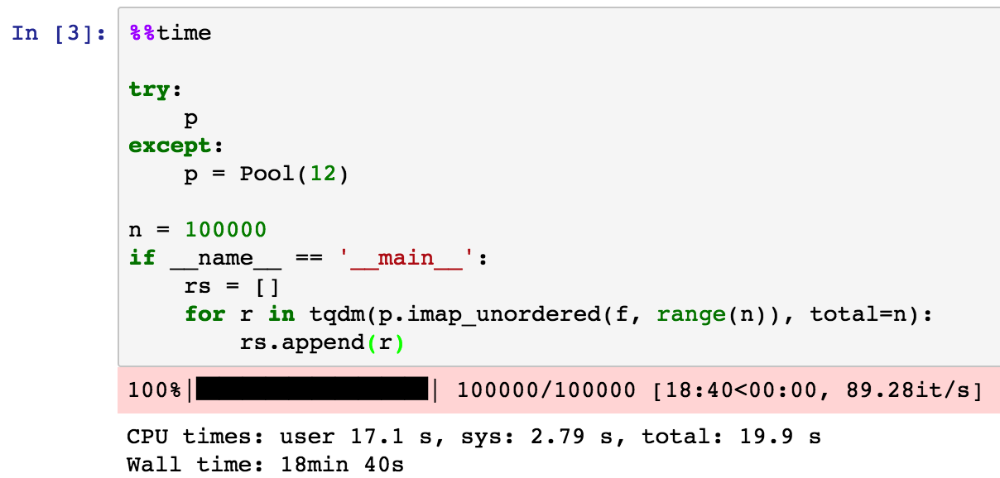

### 总结

这里我们把各个量之间的关系都画出来了，很有意思。

```py
pd.plotting.scatter_matrix(df, alpha=0.1, figsize=(14,8), diagonal='kde');
```

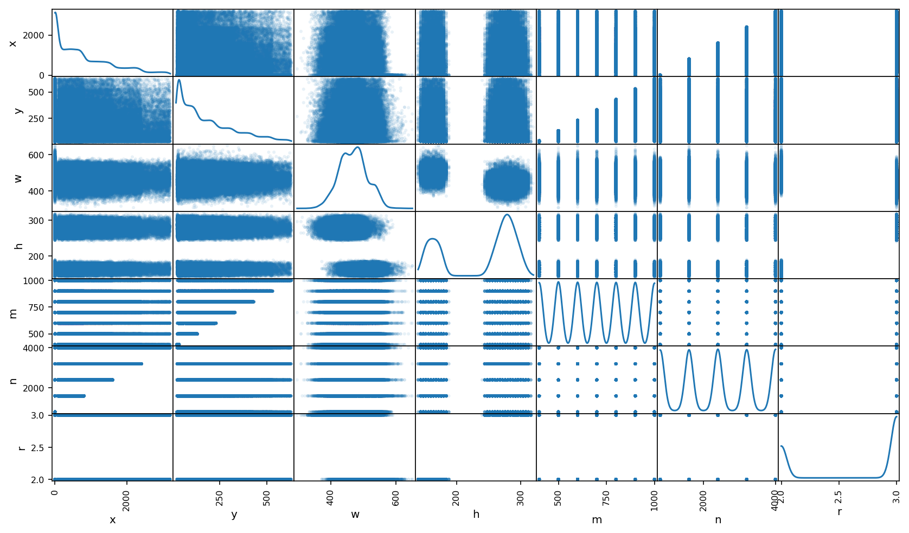

其中的 x, y 表示公式的起始坐标，w, h 表示公式的宽和高，n, m 表示原图的宽和高，r 表示有几个公式。我们可以从图中看到，x, y 没有明显的规律，稍微有一点规律就是越宽的图能得到的 x 越大（废话，宽1000的图不可能有公式出现在1200）。

w 也没有明显的规律，是典型的正态分布，而 h 则有两个峰，这是因为公式有两个和三个的差别。

m, n 很有规律，它们是按某几个固定的数随机取的，m 的取值是从 [400, 500, 600, 700, 800, 900, 1000] 中随机选取的，n 是从 [800, 1600, 2400, 3200, 4000] 中随机取的。

```py
Counter(df['m'])
Counter({400: 14233,
         500: 14414,
         600: 14332,
         700: 14304,
         800: 14293,
         900: 14299,
         1000: 14125})

Counter(df['n'])
Counter({800: 19872, 1600: 19937, 2400: 20128, 3200: 19975, 4000: 20088})
```

## 模型结构

由于我们只对 `base_model` 进行了修改，ctc 部分直接照搬之前的代码即可，因此这里我们只讨论 `base_model`，下面是代码：

```py
def ctc_lambda_func(args):
    y_pred, labels, input_length, label_length = args
    y_pred = y_pred[:, 2:, :]
    return K.ctc_batch_cost(labels, y_pred, input_length, label_length)

rnn_size = 128
l2_rate = 1e-5

input_tensor = Input((width, height, 3))
x = input_tensor
for i, n_cnn in enumerate([3, 4, 6]):
    for j in range(n_cnn):
        x = Conv2D(32*2**i, (3, 3), padding='same', kernel_initializer='he_uniform', 
                   kernel_regularizer=l2(l2_rate))(x)
        x = BatchNormalization(gamma_regularizer=l2(l2_rate), beta_regularizer=l2(l2_rate))(x)
        x = Activation('relu')(x)
    x = MaxPooling2D((2, 2))(x)

# x = AveragePooling2D((1, 2))(x)
cnn_model = Model(input_tensor, x, name='cnn')

input_tensor = Input((width, height, 3))
x = cnn_model(input_tensor)

conv_shape = x.get_shape().as_list()
rnn_length = conv_shape[1]
rnn_dimen = conv_shape[3]*conv_shape[2]

print conv_shape, rnn_length, rnn_dimen

x = Reshape(target_shape=(rnn_length, rnn_dimen))(x)
rnn_length -= 2
rnn_imp = 0

x = Dense(rnn_size, kernel_initializer='he_uniform', kernel_regularizer=l2(l2_rate), bias_regularizer=l2(l2_rate))(x)
x = BatchNormalization(gamma_regularizer=l2(l2_rate), beta_regularizer=l2(l2_rate))(x)
x = Activation('relu')(x)
# x = Dropout(0.2)(x)

gru_1 = GRU(rnn_size, implementation=rnn_imp, return_sequences=True, name='gru1')(x)
gru_1b = GRU(rnn_size, implementation=rnn_imp, return_sequences=True, go_backwards=True, name='gru1_b')(x)
gru1_merged = add([gru_1, gru_1b])

gru_2 = GRU(rnn_size, implementation=rnn_imp, return_sequences=True, name='gru2')(gru1_merged)
gru_2b = GRU(rnn_size, implementation=rnn_imp, return_sequences=True, go_backwards=True, name='gru2_b')(gru1_merged)
x = concatenate([gru_2, gru_2b])

# x = Dropout(0.2)(x)
x = Dense(n_class, activation='softmax', kernel_regularizer=l2(l2_rate), bias_regularizer=l2(l2_rate))(x)
rnn_out = x
base_model = Model(input_tensor, x)
```

在经过多次的代码迭代以后，我将 cnn 打包为了一个 model，这样模型会简洁很多：

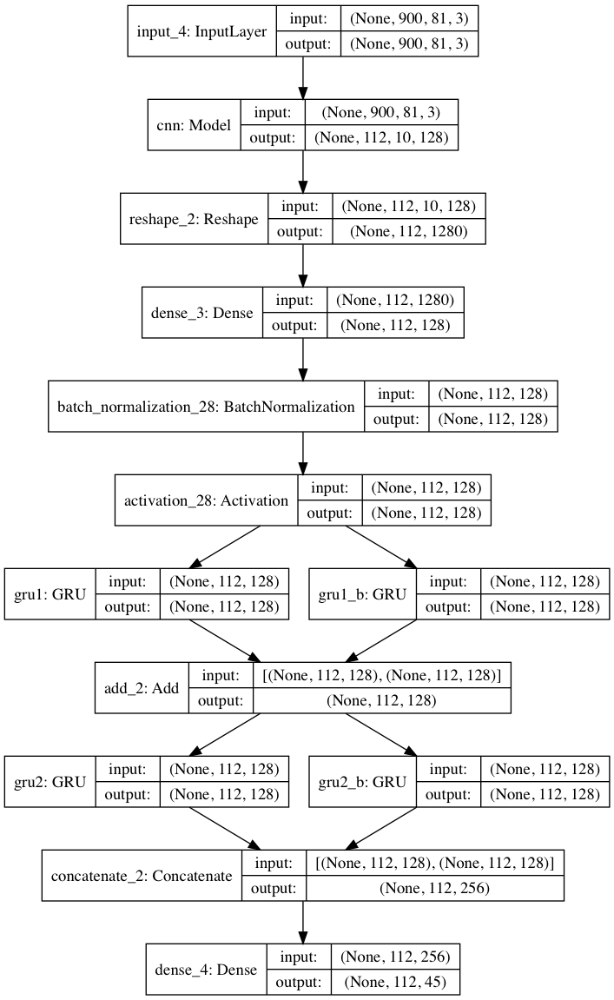

模型思路是这样的：首先输入一张图，然后通过 cnn 导出 (112, 10, 128) 的特征图，其中112就是输入到 rnn 的序列长度，10 指的是每一条特征的高度是10像素，将后面 (10, 128) 的特征合并成1280，然后经过一个全连接降维到128维，就得到了 (112, 128) 的特征，输入到 RNN 中，然后经过两层双向 GRU 输出112个字的概率，然后用 CTC loss 去优化模型，得到能够准确识别字符序列的模型。

### CNN

CNN 的结构如下图：


理论最大序列长度为46个字符（数字可能为100000，所以是 `2*9+3*6+4+4+2=46`，对于 CTC 来说，我们最好要输入大于最大长度2倍的序列，才能收敛得比较好。之前我直接卷积到50左右了，然后对于连续字符来说，没有空白能将它们分隔开来，所以收敛效果会差很多。这里的最大序列长度我之前总是算错，因为我用的是 Python2，没有 decode 成 utf-8 的话，一个中文占三个字节。

CNN 的结构由原来的两层卷积一层池化，改为了多层卷积，一层池化的结构，由于卷积层分别是3，4和6层，我称之为 346 结构。

### GRU

为什么使用 RNN 呢，这里我举一个很经典的例子：研表究明，汉字的序顺并不定一能影阅响读，比如当你看完这句话后，才发这现里的字全是都乱的。

人眼去阅读一段话的时候，是会顾及到上下文的，不是依次单个字符的识别，因此引入 RNN 去识别上下文能够极大提升模型的准确率。在决赛中，序列有几个地方都是有上下文关系的：

* 前面一个或两个赋值式一定是 中文=数字; 这样的形式
* 左括号一定会有右括号
* 括号的位置是有语法规则的
* 一定会有一个分式
* 分式的分子一定是中文
* 如果只有一个赋值式，那么表达式中的中文一定是赋值式的中文
* 如果有两个赋值式，赋值式容易看清，表达式不容易看清，那么可以通过赋值式的中文去修正表达式的中文，特别是分子中文被裁掉的时候

### 其他参数

相比之前初赛的模型，这里进行了一些修改：

* padding 变为了 same，不然我觉得特征图的高度不够，无法识别分数
* 增加了 l2 正则化，loss loss 变得更大了，但是准确率变得更高了（添加 l2 的部分包括卷积层的 kernel，BN 层的 gamma 和 beta，以及全连接层的 weights 和 bias）
* 各个层的初始化变为了 he_uniform，效果比之前好
* 去掉了 dropout，不清楚影响如何，但是反正有生成器，应该不会出现过拟合的情况
* 修改过 GRU 的 implementation 为2，原因是希望显卡能加速 GRU 的速度，但是似乎速度还不如设置为0，使用 CPU 来跑，所以又改回来了

l2 正则化的参数直接参考了 Xception 论文的 4.3 节给的参数：

> Weight decay: The Inception V3 model uses a weight decay (L2 regularization) rate of 4e-5, which has been carefully tuned for performance on ImageNet. We found this rate to be quite suboptimal for Xception and instead settled for 1e-5.

## 生成器

为了得到更多的数据，提高模型的泛化能力，我使用了一种很简单的数据扩充办法，那就是根据表达式中的中文随机挑选赋值式，组成新的样本。这里我们取了前 350*256=89600 个样本来生成，用之后的 10240 个样本来做验证集，还有一点零头因为太少就没有用了。

导入数据的时候，先读取运算式的图像，然后按中文导入赋值式的图像到字典中。因为字典中的 key 是无序的，所以我们在字典中存的是 list，列表是有序的。

```py
from collections import defaultdict

cn_imgs = defaultdict(list)
cn_labels = defaultdict(list)
ss_imgs = []
ss_labels = []

for i in tqdm(range(n1)):
    ss = df[0][i].decode('utf-8').split(';')
    m = len(ss)-1
    ss_labels.append(ss[-1])
    ss_imgs.append(cv2.imread('crop_split2/%d_%d.png'%(i, 0)).transpose(1, 0, 2))
    for j in range(m):
        cn_labels[ss[j][0]].append(ss[j])
        cn_imgs[ss[j][0]].append(cv2.imread('crop_split2/%d_%d.png'%(i, m-j)).transpose(1, 0, 2))
```

然后实现生成器，这里继承了 keras 里的 Sequence 类：

```py
from keras.utils import Sequence

class SGen(Sequence):
    def __init__(self, batch_size):
        self.batch_size = batch_size
        self.X_gen = np.zeros((batch_size, width, height, 3), dtype=np.uint8)
        self.y_gen = np.zeros((batch_size, n_len), dtype=np.uint8)
        self.input_length = np.ones(batch_size)*rnn_length
        self.label_length = np.ones(batch_size)*38
    
    def __len__(self):
        return 350*256 // self.batch_size
    
    def __getitem__(self, idx):
        self.X_gen[:] = 0
        for i in range(self.batch_size):
            try:
                random_index = random.randint(0, n1-1)
                cls = []
                ss = ss_labels[random_index]
                cs = re.findall(ur'[\u4e00-\u9fff]', df[0][random_index].decode('utf-8').split(';')[-1])
                random.shuffle(cs)
                x = 0
                for c in cs:
                    random_index2 = random.randint(0, len(cn_labels[c])-1)
                    cls.append(cn_labels[c][random_index2])
                    img = cn_imgs[c][random_index2]
                    w, h, _ = img.shape
                    self.X_gen[i, x:x+w, :h] = img
                    x += w+2
                img = ss_imgs[random_index]
                w, h, _ = img.shape
                self.X_gen[i, x:x+w, :h] = img
                cls.append(ss)

                random_str = u';'.join(cls)
                self.y_gen[i,:len(random_str)] = [characters.find(x) for x in random_str]
                self.y_gen[i,len(random_str):] = n_class-1
                self.label_length[i] = len(random_str)
            except:
                pass
        
        return [self.X_gen, self.y_gen, self.input_length, self.label_length], np.ones(self.batch_size)
```

首先随机取一个表达式，然后用正则表达式找里面的中文，再从{中文：图像数组}的字典中随机取图像，经过之前预处理的方式拼接成一个新的序列。

比如随机取了一个 `85882*(河/76020-37023)-铁`，然后我们从铁的赋值式中随机取一个，再从河的赋值式中随便取一个，拼起来就能得到下图：


可以看到背景颜色是不同的，但是并不影响模型去识别。

## 训练

我们训练的策略是先用 Adam() 默认的学习率 1e-3 快速收敛50代，然后用 Adam(1e-4) 跑50代，达到一个不错的 loss，最后用 Adam(1e-5)微调50代，每一代都保存权值，并且把验证集的准确率跑出来。图中的绿色的线 0.9977 就是按上面的方法训练的模型，

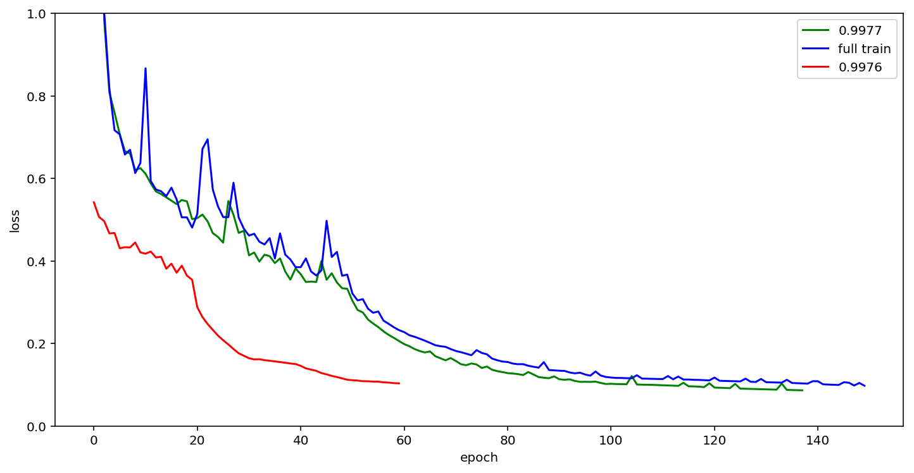

当然我们还尝试过先按 1e-3 的学习率训练20代，然后 1e-4 和 1e-5 交替训练2次，每次训练取验证集 loss 最低的结果继续训练，也就是图中红色的线，虽然速度快，但是准确率不够好。

之后我们将全部训练集都用于训练，得到了蓝色的线，效果和绿色差不多。

## 预测结果

读取测试集的样本，然后用 `base_model` 进行预测，这个过程很简单，就不讲了。

```py
X = np.zeros((n, width, height, channels), dtype=np.uint8)

for i in tqdm(range(n)):
    img = cv2.imread('crop_split2_test/%d.png'%i).transpose(1, 0, 2)
    a, b, _ = img.shape
    X[i, :a, :b] = img

base_model = load_model('model_346_split2_3_%s.h5' % z)
base_model2 = make_parallel(base_model, 4)

y_pred = base_model2.predict(X, batch_size=500, verbose=1)
out = K.get_value(K.ctc_decode(y_pred[:,2:], input_length=np.ones(y_pred.shape[0])*rnn_length)[0][0])[:, :n_len]
```

输出到文件的部分有一点值得一提，就是如何计算出真实值：

```py
ss = map(decode, out)

vals = []
errs = []
errsid = []
for i in tqdm(range(100000)):
    val = ''
    try:
        a = ss[i].split(';')
        s = a[-1]
        for x in a[:-1]:
            x, c = x.split('=')
            s = s.replace(x, c+'.0')
        val = '%.2f' % eval(s)
    except:
#         disp3(i)
        errs.append(ss[i])
        errsid.append(i)
        ss[i] = ''
    
    vals.append(val)
    
with open('result_%s.txt' % z, 'w') as f:
    f.write('\n'.join(map(' '.join, list(zip(ss, vals)))).encode('utf-8'))
    
print len(errs)
print 1-len(errs)/100000.

# output
22
0.99978
```

其中的思路说起来也很简单，就是将表达式中的赋值式中文替换为赋值式的数字，然后直接用 python eval 得到结果，算不出来的直接留空即可。这个0.9977模型的可算率达到了0.99978，也就是说十万个样本里面只有22个样本不可算，当然，实际上还是有一些样本即使可算，也会因为各种原因识别错，比如5和6就是错误的重灾区，某些数字被干扰线切过，导致肉眼都辨认不清等。

## 模型结果融合

模型结果融合的规则很简单，对所有的结果进行次数统计，先去掉空的结果，然后取最高次数的结果即可，其实就是简单的投票。

```py
import glob
import numpy as np
from collections import Counter

def fun(x):
    c = Counter(x)
    c[' '] = 0
    return c.most_common()[0][0]

ss = [open(fname, 'r').read().split('\n') for fname in glob.glob('result_model*.txt')]
s = np.array(ss).T
with open('result.txt', 'w') as f:
    f.write('\n'.join(map(fun, s)))
```

将上面 loss 图中的三个模型结果融合以后，最后得到了0.99868的测试集准确率。

## 其他尝试

### 不定长图像识别

在比赛刚开始的时候，尝试过将图像的宽度设置为 None，也就是不定长的宽度，但是由于无法解决 reshape 的问题，这个方案被否了。

### 分别识别

之前尝试过图像切成几块，分别识别，赋值式和表达式的模型分开，考虑到由于无法得到上下文的信息，可能会丢失一定的准确率，做到一半否掉了这个方案。

### 生成器尝试

我们尝试过写一个生成器，但是由于和官方给的图像差太远，并且实际测试的时候要么是生成的准确率高，官方的准确率低，要么反过来，所以没有投入使用。

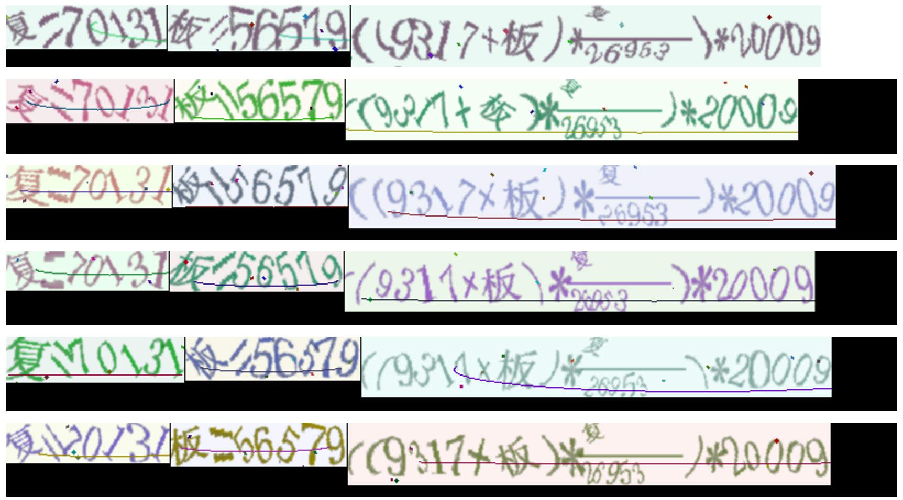

上图第一个是官方的图像，后面五个是我们的生成器生成的，可以看到我们的字没有官方的紧凑，等号也不太一样，分式我们的字又太紧凑了。

### 其他 CNN 模型的尝试

除了自己搭模型，我还尝试过用 ResNet，DenseNet 替换 CNN，然后去训练，但是由于本身这些模型就很大，训练起来速度很慢，然后主要问题又不在模型不够复杂，因为从绘制出来的 loss 曲线来看，虽然前面的 val_loss 一直在抖，但是在第50代学习率下降以后就非常平缓了，这模型是没有过拟合的：

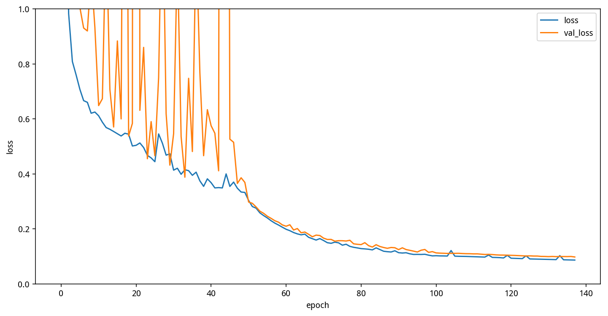

### 替换 GRU 为 LSTM

在比赛最后尝试过将 GRU 替换为 LSTM，得到的结果是十分类似的，但是提交上去以后准确率有轻微下降（多错了几个样本，可能是运气问题），之前做验证码识别的时候也是替换过，效果差不多，因此没有继续尝试。理论上这个序列长度并没有很长，GRU 和 LSTM 影响不大。

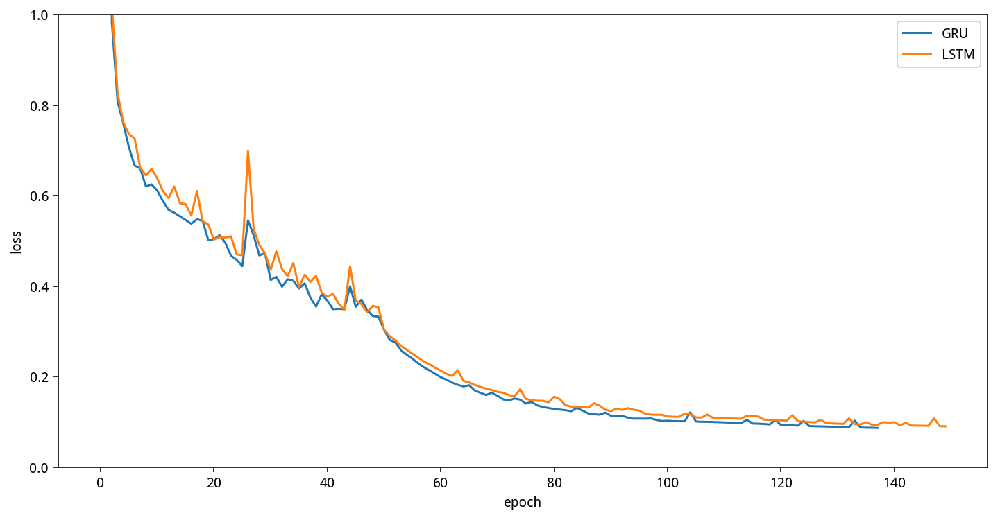

## 总结

### 对项目的思考

本项目中，需要注意以下几个重要的点：

* 数据准备：
 * 深度学习同传统图像处理技术结合，可以达到更好的准确率
 * 文本识别可以构造验证码生成器进行数据增强，增加训练样本数
* 模型优化：
 * 如何根据项目特点，对模型结构进行调整，如CNN 部分减少池化层使用，等等
 * 为了防止过拟合，在模型中引入 L2 正则化
* 模型训练：
 * 使用学习率衰减策略，训练模型
 * 对复杂的模型，可以将同一批次输入数据分摊给多个GPU进行计算。

### 有趣的样本

#### 95170

在测试集里有一个 95170.png 样本很难分割：

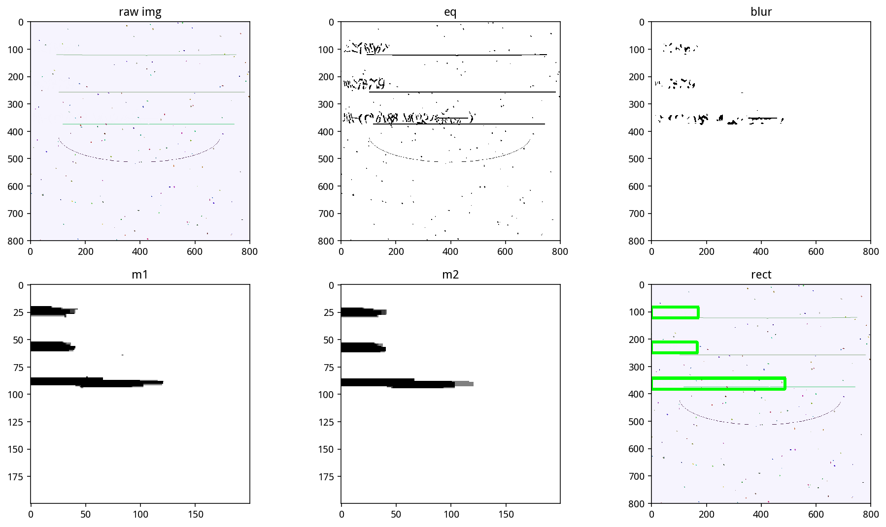

因为它的字太浅了，很难被切割出来，肉眼也基本无法分辨。

它的表达式也很难切，稍有不慎就切掉中文了：


#### 干扰线

在我们分割的验证集中，发现了被干扰线成功干扰的样本：


我们可以看到第一个 7 倾斜以后加上一条干扰线，很容易就被模型认成4了，但是人类却不会犯这样的错，这也是 CNN 和 人类之间的区别，目测卷积层自动把图像转灰度图了。

### 可能的改进

* 将真正的生成器写出来，这样就可以获取无穷无尽的样本，而不是使用已有的样本进行拼接，对5和6的识别，以及很多横向的中文的识别，会有很好的帮助，因为它们在已有样本中十分罕见，以至于模型无法准确分辨5和6，以及横向的中文
* 做更好的预处理，比如干扰线和字的颜色是不同的，可以通过程序去除，切图可以更精准一些，可以极大提高训练速度
* 使用其他的模型，比如群里有人提到的 attention 模型，或者看看 OCR 相关的论文，找更多的模型，融合结果，比直接跑类似结构的模型来融合的效果会好很多